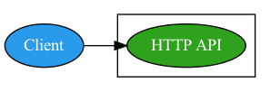

# gosk-api
Go Starter Kit for HTTP API Applications

## Architecture

<p align="center">
  
</p>

## Installation
Clone the repository
```sh
$ git clone git@github.com:jasonsites/gosk-api.git
$ cd gosk-api
```

## Development
TBD

## Contributing
TBD

## Releasing
TBD

## License
Copyright (c) 2022 Jason Sites
