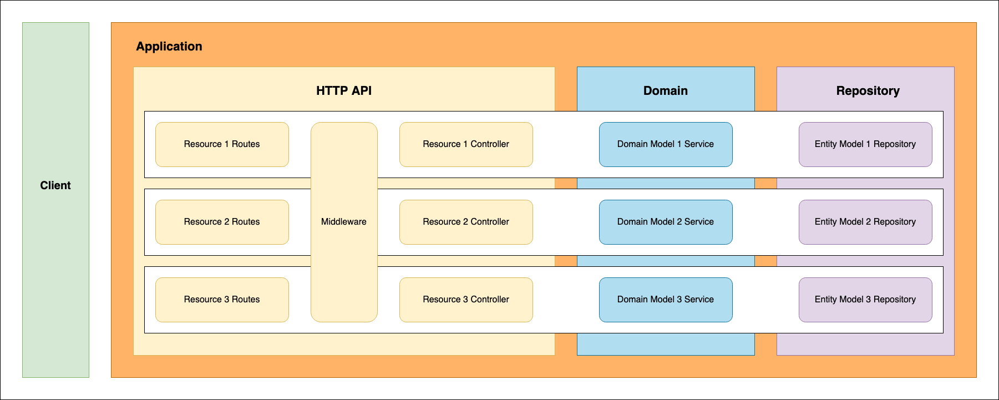

# Application Design & Architecture

## Application Layering
The code is comprised of many [components](#application-components), but the application design consists of 3 primary layers:
  - `External Interfaces` provide the application API(s). In this kit, the only interface implemented is an `HTTP API`. However, a `gRPC` or `CLI` package could also be implemented, providing alternate APIs.
  - `Domain Services` contain all application business (domain) logic.
  - `Repositories` provide an abstraction and interface for resource state management.

<p align="center">
  
</p>

The primary design drivers for the application are:
  1. Separation of concerns through modularity
  1. Loose coupling through dependency inversion

### Modularity & Functional Isolation
To keep the application in a highly maintainable and extendable state, it is important to maintain strict boundaries around each of the layers.

For example, the HTTP API (external interface) layer is concerned with all HTTP concepts, including HTTP status codes. Care should be taken not to allow HTTP concepts to leak into the domain logic or repository layers. An application could use both HTTP and gRPC APIs simultaneously, which have very different sets of status codes.

Another example is the repository implementation details. All calls from a service to a repository are abstracted so that any knowledge of the underlying database server are isolated to the repository. This starter kit uses PostgresQL because that will be the most common use case, but there may be an entirely different datastore or multiple datastores in a real-world application. In any case, the domain logic should never be concerned with the underlying db technology.

### Dependency Inversion
This design uses [Dependency Inversion](https://en.wikipedia.org/wiki/Dependency_inversion_principle) to maintain loose coupling between layers.

Each resource controller in the HTTP API (`controllers`) package requires a domain service to be injected on app initialization. The controller does not know how the service is implemented; only that the service satisfies the `Service` interface, which provides basic CRUD operations for managing business logic.

In a similar fashion, each domain service requires a repository to be injected on app initialization. The service is unaware of the repository implementation details, but relies on it to satisfy the `Repository` interface, which provides basic CRUD operations for managing state.

## Application Components
### Main
```
cmd/server/main.go
```

`main.go` is the application entrypoint. It's only purpose is the instantiate and run a new `runtime` with the default `resolver` configuration.

### Runtime
```
internal/runtime
```
The `runtime` package is responsible for creating a new application-level context, a new `resolver` instance, and starting:
1. a primary goroutine for initializing all resolver singletons, and starting an HTTP server.
1. a secondary goroutine for gracefully shutting down the http server and any open database connections.

### Resolver
```
internal/resolver
```
The `resolver` package provides a way to control how the application initializes. It creates singleton instances of all relevant application components. In development and production, the state of the `config` package determines how the resolver is configured. But configuration can also be provided when instantiating the resolver in order to tightly control the state of the application, which can be useful for testing.

### Config
```
config
```
The `config` package handles all app configuration. The `config.toml` file can be used for configuration defaults, and the `config.go` file can be modified to create environment variables for configuration overrides.

### Types
```
internal/types
```
The types package is used for declaring data types that may be shared across packages.

### Validation
```
internal/validation
```
The `validation` package creates a new singleton validator used across the application. As an aside, although it is also a singleton, the validator is not included with the resolver because its scope is much broader.

### HTTP API
```
internal/http
```
The `http` package contains everything related to the HTTP interface layer of the application. It handles server and router instantiation, and contains 3 sub-packages:
1. The `routes` package declares and manages all HTTP API routes
1. The `middleware` package houses the middleware available to all routes
1. The `controllers` package provides the route handlers, which parse and validate request data before passing data along to the `application` services layer.

:exclamation: All HTTP concerns should be scoped to this package or sub-packages.

### Domain
```
internal/domain
```
The `domain` package composes all resource `services`. This is the business (or domain) logic layer of the application. In the starter kit example code, each service method calls an associated repository method and serializes the result as a JSON payload to pass back to the calling controller. In real-world scenarios, the domain services may handle more advanced logic, such as authorization, requests to external APIs, and other behavior to support business use cases.

:exclamation: All business logic concerns should be scoped to this package.

### Repository
```
internal/repo
```
The `repo` package contains all resource repositories. Each repository handles all database interactions necessary to support state management for a resource and any associated db entities.

:exclamation: All state management concerns should be scoped to this package.
